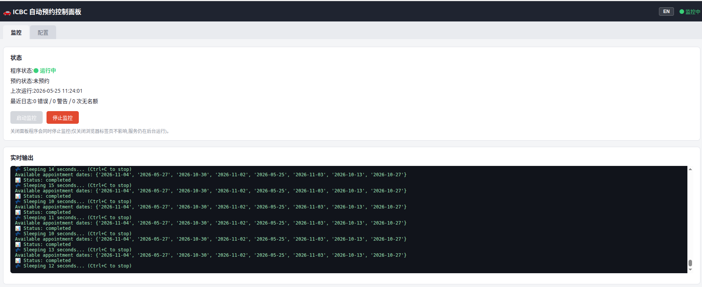

# ICBC 自动预约系统

[](https://github.com/gaoxiaowei2117/icbc-roadtest-auto-booking/releases/latest)
[](https://github.com/gaoxiaowei2117/icbc-roadtest-auto-booking/releases/latest/download/icbc-control-panel-windows.zip)
[](https://github.com/gaoxiaowei2117/icbc-roadtest-auto-booking/releases/latest/download/icbc-control-panel-macos.zip)
[](https://github.com/gaoxiaowei2117/icbc-roadtest-auto-booking/releases/latest/download/icbc-control-panel-linux.zip)

🚗 **智能化ICBC路考预约助手** - 自动监控、自动预约、自动退出的一站式解决方案

> English version: [README.md](README.md)
>
> 💡 **Windows 用户、没有编程基础?** 直接看图文版手册 → [**WINDOWS_SETUP.zh.md**](WINDOWS_SETUP.zh.md),跟着做 10 分钟就能跑起来。

## 📋 目录

- [功能特性](#-功能特性)
- [系统要求](#-系统要求)
- [快速开始](#-快速开始)
- [详细配置](#-详细配置)
- [使用方法](#-使用方法)
- [故障排除](#-故障排除)
- [文件说明](#-文件说明)

## ✨ 功能特性

### 🤖 核心功能
- **全自动预约**：找到合适时间后自动提交预约
- **Gmail集成**：自动读取邮箱中的验证码
- **智能选择**：根据偏好自动选择最佳时间段
- **预约成功退出**：完成预约后自动停止程序

### 🛡️ 安全可靠
- **预约冲突检测**：避免重复预约
- **智能重试机制**：网络错误自动重试
- **状态持久化**：记录预约状态，防止重复操作
- **完善日志**：详细记录所有操作过程

### 🎯 用户友好
- **一键启动**：简单的启动脚本
- **状态监控**：实时查看系统运行状态
- **详细文档**：完整的使用指南

## 🖥️ 系统要求

- **操作系统**：Linux / macOS / Windows
- **Python版本**：3.7+
- **网络连接**：能访问ICBC官网和Gmail
- **Gmail账户**：需要开启2FA并生成应用密码

## 📦 免安装版（不需要装 Python）

不想装 Python？直接到 [**Releases 页面**](https://github.com/gaoxiaowei2117/icbc-roadtest-auto-booking/releases) 下载对应系统的单文件可执行版：

| 系统 | 下载文件 |
|------|----------|
| Windows (x64) | `icbc-control-panel-windows.zip` |
| macOS (Apple Silicon) | `icbc-control-panel-macos.zip` |
| Linux (x64) | `icbc-control-panel-linux.zip` |

解压后双击 `icbc-control-panel(.exe)`，浏览器会自动打开控制面板。
首次运行会在 exe 同目录自动生成 `config.yml`，在"配置"页填好后切到"监控"页点"启动监控"即可。

> 包未做代码签名，Windows SmartScreen 和 macOS Gatekeeper 首次运行会拦一下 —
> 解压后看 `README.txt` 里的详细绕过步骤（含截图位置说明）。
> **macOS 命令行快速放行**：终端执行
> `xattr -dr com.apple.quarantine <解压后的目录>` 即可，之后双击直接启动。
> Intel Mac 与 32 位 Windows 用户暂时只能用源码方式运行。

## 🚀 从源码运行

### 1. 克隆或下载项目

```bash
# 如果使用git
git clone <repository_url>
cd roadtest

# 或者直接下载解压到roadtest目录
```

### 2. 安装依赖

```bash
# Ubuntu/Debian
sudo apt update
sudo apt install python3 python3-pip

# CentOS/RHEL
sudo yum install python3 python3-pip

# macOS (使用Homebrew)
brew install python3

# Windows: 从python.org下载安装Python 3.7+
```

安装Python依赖库：

```bash
pip3 install -r requirements.txt

# 如果遇到权限问题，使用：
pip3 install --user -r requirements.txt
```

### 3. 配置Gmail应用密码

> 为什么要这个？程序要自动从你的 Gmail 读 ICBC 的验证码。Google 不允许第三方用你真正的登录密码，只能用一次性生成的 **16 位应用密码**，泄露了也只能收发邮件、无法登录你的账户。

**第一步：开启两步验证**（已经开过的可以跳到第二步）

1. 点这个链接：<https://myaccount.google.com/signinoptions/two-step-verification>
2. 按提示点 **「开始使用」/「Get Started」**，绑定手机号收验证短信，完成开启即可。

**第二步：生成应用密码**

1. 直接打开：<https://myaccount.google.com/apppasswords>
   - 如果提示找不到此页面，说明第一步两步验证还没开 → 回到第一步先开。
2. 在「**应用名称**」输入框里随便填一个名字，比如 `ICBC`，点 **「创建」/「Create」**。
3. 屏幕会弹出一个像 `abcd efgh ijkl mnop` 的 **16 位密码**（4 组各 4 个字符，中间有空格）。
4. **立刻复制**这串密码——关掉就再也看不到了。粘贴到记事本里暂存，稍后填进 `config.yml`。

> 💡 这 16 位密码可以连空格一起粘贴，也可以去掉空格，都能用。

### 4. 配置系统

编辑 `config.yml` 文件：

```yaml
# Gmail配置
gmail:
  enable: true  # 开启Gmail集成
  email: "your-email@gmail.com"  # 你的Gmail地址
  password: "abcd efgh ijkl mnop"  # 上面生成的16位应用密码

# 自动预约配置
autoBooking:
  enable: true  # 开启自动预约
  exitAfterSuccess: true  # 预约成功后退出
```

### 5. 运行系统

```bash
# 使用一键启动脚本（推荐）
chmod +x start.sh
./start.sh

# 或直接运行生产模式
python3 road.py config.yml
```

## ⚙️ 详细配置

### config.yml 完整配置说明

```yaml
# ICBC账户信息
icbc:
  drvrLastName: "Your_Last_Name"      # 姓氏
  licenceNumber: "12345678"           # 驾照号码
  keyword: "123456"                   # 关键字/密码
  examClass: "5"                      # 考试类别
  posID: "123"                        # 考点ID
  expactAfterDate: "2025-08-10"       # 期望最早日期
  expactBeforeDate: "2025-09-22"      # 期望最晚日期
  expactTimeRange: "10:00-11:30,13:00-14:10"  # 期望时间段
  prfDaysOfWeek: "[0,1,2,3,4,5,6]"    # 偏好星期（0=周日）
  prfPartsOfDay: "[0,1]"              # 偏好时段（0=上午,1=下午）

# Gmail配置（必须用于自动预约）
gmail:
  enable: true                        # 是否启用Gmail
  email: "your-email@gmail.com"       # Gmail地址
  password: "your-app-password"       # Gmail应用密码（16位）
  imap_server: "imap.gmail.com"       # IMAP服务器
  imap_port: 993                      # IMAP端口

# 自动预约配置
autoBooking:
  enable: true                        # 是否启用自动预约
  timeSelectionStrategy: "earliest"   # 时间选择策略
  maxRetryAttempts: 3                 # 最大重试次数
  retryIntervalSeconds: 30            # 重试间隔（秒）
  verificationCodeTimeoutMinutes: 10  # 验证码超时（分钟）
  bookingTimeWindow: "08:00-22:00"    # 预约时间窗口
  exitAfterSuccess: true              # 成功后退出

# 通知配置（可选）
ntfy:
  enable: false                       # Ntfy推送
  topic: ""                           # Ntfy主题

pushlocal:
  enable: false                       # 本地通知
```

## 📖 使用方法

### 🎮 一键启动脚本

```bash
./start.sh
```

启动后选择模式：
- `1` - 🚀 生产模式（连接真实ICBC系统）
- `2` - 📊 查看状态
- `3` - 📋 查看日志
- `4` - ⚙️ 配置(交互式编辑 config.yml)
- `5` - 🖥️ 打开控制面板(网页版)

### 控制面板(网页版)

```bash
python3 webui.py
```

启动一个本地控制面板并自动在浏览器中打开。在面板里可以编辑配置、启动/停止
监控、查看实时状态和输出,全程无需命令行。仅用 Python 标准库,不需要安装额外
依赖。服务只绑定 `127.0.0.1`。



注意:停止 `webui.py`(Ctrl+C)会一并停止正在运行的监控;仅关闭浏览器标签页
不会,服务仍在后台运行。

### 🚀 生产模式

```bash
python3 road.py config.yml
```

连接真实ICBC系统进行监控和自动预约。

### 📊 状态监控

```bash
python3 status.py
```

显示系统当前状态，包括：
- 配置状态
- 预约状态
- 程序运行状态
- 日志摘要

### 📋 查看日志

```bash
# 实时查看日志
tail -f log_icbc_roadtest_checker.log

# 查看最近100行
tail -n 100 log_icbc_roadtest_checker.log

# 搜索特定内容
grep "ERROR" log_icbc_roadtest_checker.log
```

## 🔧 故障排除

### 常见问题

#### 1. Gmail连接失败

**错误**：`Failed to connect to Gmail`

**解决方案**：
```bash
# 检查配置
grep -A 5 "gmail:" config.yml

# 确认使用的是应用密码，不是普通密码
# 确认已开启Gmail 2FA
# 确认应用密码是16位字符
```

#### 2. Python依赖缺失

**错误**：`ModuleNotFoundError: No module named 'requests'`

**解决方案**：
```bash
# 安装所有依赖
pip3 install -r requirements.txt

# 如果使用虚拟环境
python3 -m venv venv
source venv/bin/activate  # Linux/Mac
# venv\Scripts\activate   # Windows
pip install -r requirements.txt
```

#### 3. ICBC服务器错误

**错误**：日志显示520/524错误

**解决方案**：
```bash
# 这是ICBC服务器问题，等待恢复
# 程序会自动重试，无需人工干预

# 检查网络连接
ping onlinebusiness.icbc.com

# 查看系统状态
python3 status.py
```

#### 4. 配置验证失败

**错误**：`Configuration Issues Found`

**解决方案**：
```bash
# 检查配置文件语法
python3 -c "import yaml; yaml.safe_load(open('config.yml'))"

# 验证必填字段
python3 -c "
import yaml
config = yaml.safe_load(open('config.yml'))
print('ICBC配置:', config.get('icbc', {}))
print('Gmail配置:', config.get('gmail', {}))
print('自动预约配置:', config.get('autoBooking', {}))
"
```

#### 5. 权限问题

**错误**：`Permission denied`

**解决方案**：
```bash
# 给启动脚本执行权限
chmod +x start.sh

# 检查文件权限
ls -la *.py *.yml *.sh

# 如果需要，修改权限
chmod 644 config.yml
chmod 755 *.py
```

### 🔍 调试模式

启用详细日志：

```bash
# 修改日志级别为DEBUG
sed -i 's/level=logging.INFO/level=logging.DEBUG/' road.py

# 运行程序查看详细日志
python3 road.py config.yml
```

### 📞 获取帮助

如果问题依然存在：

1. **查看日志**：`tail -n 50 log_icbc_roadtest_checker.log`
2. **检查状态**：`python3 status.py`
3. **检查配置**：确认config.yml所有必填项已正确填写

## 📁 文件说明

```
roadtest/
├── README.md                  # 英文版（默认）
├── README.zh.md               # 本文件（中文）
├── road.py                    # 主程序（生产模式）
├── status.py                  # 状态检查工具
├── start.sh                   # 一键启动脚本
├── config.example.yml         # 配置模板（已提交到仓库）
├── config.yml                 # 本地配置（已被 .gitignore 忽略）
├── requirements.txt           # Python 依赖列表
├── AUTO_BOOKING_GUIDE.md      # 详细使用指南
├── PROJECT_SUMMARY.md         # 项目总结
└── 运行时文件/
    ├── log_icbc_roadtest_checker.log  # 运行日志
    ├── booking_status.json            # 预约状态
    └── last_run.txt                   # 最后运行时间
```

### 核心文件说明

| 文件 | 说明 | 用途 |
|------|------|------|
| `road.py` | 主程序 | 连接真实ICBC系统进行自动预约 |
| `config.example.yml` | 配置模板 | 复制为 `config.yml` 后再填入真实账户信息 |
| `config.yml` | 本地配置 | 包含敏感字段，已 .gitignore，不会被提交 |
| `status.py` | 状态工具 | 查看系统运行状态和历史 |
| `start.sh` | 启动脚本 | 一键启动，选择运行模式 |

## 🚀 快速命令参考

```bash
# 安装系统
sudo apt install python3 python3-pip  # Ubuntu
pip3 install -r requirements.txt

# 配置Gmail
# 1. 开启2FA
# 2. 生成应用密码
# 3. 编辑config.yml

# 运行系统
./start.sh                    # 一键启动
python3 road.py config.yml    # 生产模式
python3 status.py             # 查看状态

# 监控系统
tail -f log_icbc_roadtest_checker.log  # 实时日志
python3 status.py                      # 系统状态
ls -la booking_status.json             # 预约状态文件

# 停止程序
Ctrl+C                         # 停止运行中的程序
pkill -f "python3 road.py"     # 强制停止
```

## 🎯 使用流程

1. **安装依赖** → 2. **配置Gmail** → 3. **编辑config.yml** → 4. **启动生产模式** → 5. **等待自动预约成功**

## 🎉 预约成功后

当系统成功预约后：
- ✅ 程序自动退出
- 📧 发送成功通知邮件/短信
- 💾 保存预约状态到 `booking_status.json`
- 📝 记录详细日志

## ⚠️ 重要提醒

1. **Gmail安全**：务必使用应用密码，不要使用普通密码
2. **保护本地配置**：`config.yml` 含敏感信息（驾照号、关键字、Gmail 应用密码），已被 `.gitignore`，切勿提交
3. **网络环境**：确保能正常访问ICBC官网和Gmail
4. **监控日志**：定期查看日志确保系统正常运行
5. **预约确认**：预约成功后请登录ICBC官网确认

---

🎊 **恭喜！** 你现在拥有了一个完全自动化的ICBC预约系统。系统将7×24小时为你监控预约时间，一旦发现合适的时间就会自动完成预约。再也不用手动刷新网页了！